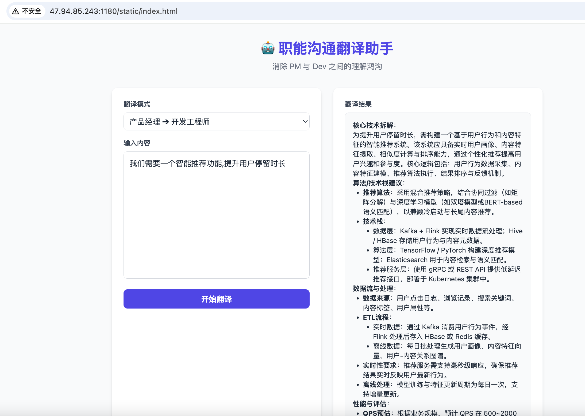
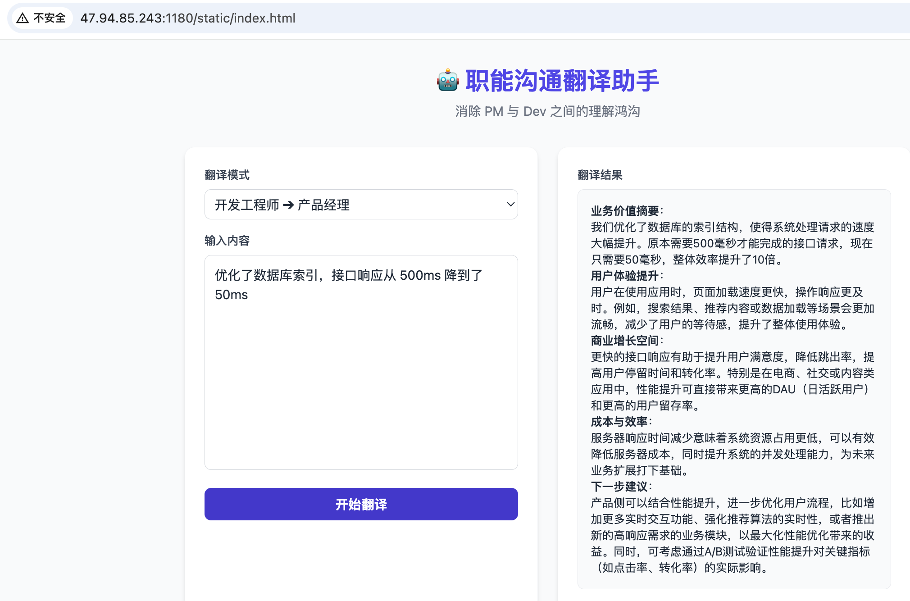

# 🤖 职能沟通翻译助手 (AI Translation Assistant)






```
注：

目前在服务器做了部署，可以通过在线地址直接访问体验：
http://47.94.85.243:8002/static/index.html
```


## 📖 项目简介
本项目是一个基于 **FastAPI** 和 **阿里通义千问大模型** 的沟通辅助工具。它旨在解决产品经理（PM）与开发工程师（Dev）在协作中的语义鸿沟，通过 AI 将“业务需求”转化为“技术规范”，或将“技术成果”转化为“商业价值”。

## 🛠 技术栈
- **后端**: Python 3.9+, FastAPI (流式响应)
- **AI 模型**: 阿里通义千问 (DashScope SDK)
- **前端**: 原生 HTML/JS + TailwindCSS (无构建依赖，轻量级)
- **工程化**: 模块化目录结构，分离源码与部署配置

## 📂 目录结构
本项目采用了清晰的工程化分层结构：

```text
.
├── README.md            # 项目说明文档
├── deploy/              # 部署与环境配置
│   ├── init.sh          # 初始化脚本
│   └── requirements.txt # Python 依赖列表
├── src/                 # 后端源代码
│   └── main.py          # FastAPI 核心逻辑 & Prompt 设计
└── static/              # 前端静态资源
    └── index.html       # 单页应用入口
```

## 🚀 快速开始

### 1. 环境准备与依赖安装

建议使用 Python 虚拟环境。

```
# 安装依赖 (注意路径变更)
pip install -r deploy/requirements.txt
```

### 2. 配置密钥

本项目依赖阿里 DashScope 服务。请在终端导出环境变量：

```
export DASHSCOPE_API_KEY="sk-你的key"
```

### 3. 启动服务

请在项目**根目录**下运行以下命令：

**方式 A：直接运行 Python 脚本**

```
python src/main.py
```

**方式 B：使用 Uvicorn (推荐)**

```
uvicorn src.main:app --reload
```

启动成功后，浏览器访问：
👉 http://localhost:8000/static/index.html


## 💡 核心设计思路 (Prompt Engineering)

为了精准模拟角色差异，采用了 **Role-Playing (角色扮演)** + **Few-Shot (少样本)** 策略：

1. **P2D (产品转开发) 模式**:
   - **Persona**: 设定 AI 为“资深技术架构师”。
   - **Focus**: 强制 AI 补充*算法选型*、*数据流向*、*性能指标*。
   - *解决痛点*: 开发人员往往抱怨需求只有一句话，缺乏技术细节。
2. **D2P (开发转产品) 模式**:
   - **Persona**: 设定 AI 为“懂技术的产品总监”。
   - **Focus**: 强制 AI 解释*用户体验*、*商业价值*、*ROI*。
   - *解决痛点*: 产品经理听不懂“重构”、“QPS”、“微服务”对业务有什么用。

## 📝 测试用例记录

### 场景 1：需求评审

**输入 (PM)**: "我们需要一个智能推荐功能，提升用户停留时长"
**AI 输出**:

> - **核心技术**: 建议使用协同过滤 + 内容召回的双塔模型。
> - **数据要求**: 需要实时接入用户点击流日志 (Kafka)。
> - **工作量预估**: 后端接口 3d，算法模型训练 5d。

### 场景 2：技术汇报

**输入 (Dev)**: "优化了数据库索引，接口响应从 500ms 降到了 50ms"
**AI 输出**:

> - **用户价值**: 用户打开页面几乎瞬间加载，不再有卡顿感。
> - **商业影响**: 极低延迟有助于提升转化率，预计降低 20% 跳出率。

------
